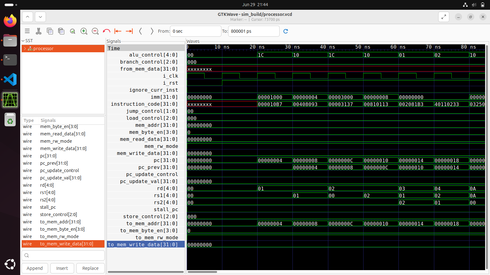

# RV32I Processor Design in SystemVerilog

## Overview

This project implements a modular RV32I RISC-V processor in SystemVerilog as part of the Texas Instruments Women in Semiconductor Hardware (WiSH) Program.

The processor is built using a modular architecture consisting of instruction fetch, decode, execute, memory access, and register file units. The design supports a subset of the RISC-V RV32I instruction set and was verified using Cocotb-based testbenches.

---

## Architecture

The processor follows a modular datapath architecture:

---

## Features

### Instruction Fetch Unit (IFU)

* Program Counter (PC) management
* Instruction fetching
* Sequential and control-flow based PC updates

### Instruction Decode Unit (IDU)

* Instruction decoding
* Immediate generation
* Register address extraction
* Control signal generation

### Integer Execute Unit (IEU)

* Arithmetic operations
* Logical operations
* Shift operations
* Comparison operations

### Register File

* 32 general-purpose registers
* Dual-read, single-write architecture

### Load / Store Unit

* Memory read operations
* Memory write operations
* Byte, half-word, and word accesses

### Branch and Jump Unit

* Conditional branches
* Unconditional jumps
* Program control flow management

### Memory Interface

* Instruction and data memory access
* Arbitration support

---

## Supported RV32I Instructions

| Category        | Instructions                                         |
| --------------- | ---------------------------------------------------- |
| R-Type          | ADD, SUB, XOR, AND, OR, SLL, SRL, SRA, SLT, SLTU     |
| I-Type          | ADDI, XORI, ORI, ANDI, SLLI, SRLI, SRAI, SLTI, SLTIU |
| Load            | LB, LH, LW, LBU, LHU                                 |
| Store           | SB, SH, SW                                           |
| Branch          | BEQ, BNE, BLT, BGE, BLTU, BGEU                       |
| Jump            | JAL, JALR                                            |
| Upper Immediate | LUI, AUIPC                                           |

## Verification

The processor was verified using **Cocotb** testbenches at both the module and processor level.

Verification includes:

- Instruction Fetch Unit (IFU)
- Instruction Decode Unit (IDU)
- Register File
- ALU operations
- Branch and Jump control
- Load and Store operations
- Memory Interface
- Complete RV32I instruction execution

---

## Tools and Technologies

* SystemVerilog
* Cocotb
* Python
* Icarus Verilog
* GTKWave
* Git
* GitHub

---

## Learning Outcomes

- RTL Design using SystemVerilog
- RV32I Processor Architecture
- Functional Verification using Cocotb
- Digital Design Debugging with GTKWave
- Hardware/Software Co-design Concepts

  
## Result Waveform

  

## Acknowledgement

This project was developed as part of the Texas Instruments Women in Semiconductor Hardware (WiSH) Program, providing hands-on exposure to processor design, RTL development, and verification methodologies.

